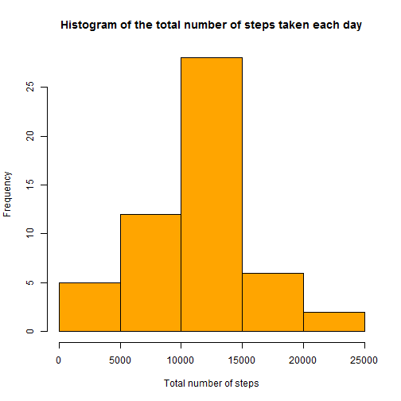

Reproducible Research: Peer Assessment 1
======================================================

### Loading and preprocessing the data

```r
# load the original data
orig.data       <-  read.csv("activity.csv")
# change the class of date variable from factor to date
orig.data$date  <-  as.Date(orig.data$date)
# aggregate the no. of steps by date (will not consider NA values by default )
databydate      <-  aggregate(steps~date,orig.data,sum)
```

### What is mean total number of steps taken per day?
Histogram of the total number of steps taken each day:


```r
hist(databydate$steps, col = "orange", main = "Histogram of the total number of steps taken each day", xlab = "Total number of steps")
```

 

The mean of total number of steps taken per day


```r
#mean
mean(databydate$steps)
```

```
## [1] 10766
```

The median of total number of steps taken per day


```r
#median
median(databydate$steps)
```

```
## [1] 10765
```

### What is the average daily activity pattern?

A time series plot of the 5-minute interval (x-axis) and the average number of steps taken, averaged across all days (y-axis)


```r
# aggregate the average no. of steps by interval (will not consider NA values by default )
databyinterval    <-  aggregate(steps~interval,orig.data, mean)

# plot between 5-minute interval (x - axis) and the average number of steps taken (y - axis)
plot(databyinterval$interval,databyinterval$steps, type = 'l', main = " Time series plot of the 5-minute interval and \nthe average number of steps taken, averaged across all days", xlab = "5-minute intervals", ylab = "Average number of steps taken", col = "blue")
```

 

5-minute interval, on average across all the days in the dataset, which contains the maximum number of steps:


```r
# 5-minute interval which contains the maximum number of steps
databyinterval$interval[max(databyinterval$steps)]
```

```
## [1] 1705
```

### Imputing missing values

Total number of missing values in the dataset (i.e. the total number of rows with NAs)


```r
# Total number of missing values in the dataset
nrow(orig.data) - nrow(na.omit(orig.data))
```

```
## [1] 2304
```

A strategy for filling in all of the missing values in the dataset.


```r
# separate the data with NA
dataNA      <-  is.na(orig.data)
datawithna  <-  orig.data[dataNA,]
# assign different column names
colnames(datawithna)  <-  c("stepsna", "datena", "intervalna")

# merge datawithna with datawithinterval
mergeddata1 <-  merge(datawithna, databyinterval, by.x = "intervalna", by.y = "interval", all = TRUE)
# sort the mergeddata1 acoording to datena
mergeddata1 <-  mergeddata1[order(mergeddata1$datena),]
# fill the missing values with the 5 - minute interval average for the corresponding date
mergeddata1$stepsna   <-  mergeddata1$steps
# subset the mergeddata1 (only required variables)
subsetteddata2 <-  subset(mergeddata1, select = c(intervalna, stepsna, datena))

# merge with the original data
mergeddata2 <-  merge(orig.data, subsetteddata2, by.x = c("date", "interval"), by.y = c("datena", "intervalna"), all = TRUE)

# filling the NA values
badstep     <-  is.na(mergeddata2$steps)
badstepsna  <-  is.na(mergeddata2$stepsna)
mergeddata2$steps[badstep]  <-  mergeddata2$stepsna[!badstepsna]
```

A new dataset that is equal to the original dataset but with the missing data filled in


```r
# final data
final.data  <-  subset(mergeddata2, select = c(steps, date, interval))
```

Histogram of the total number of steps taken each day 


```r
databydate2 <-  aggregate(steps~date,final.data,sum)
hist(databydate2$steps, col = "red", main = "Histogram of the total number of steps taken each day", xlab = "Total number of steps")
```

 

The mean of total number of steps taken per day


```r
#mean
mean(databydate2$steps)
```

```
## [1] 10766
```

The median of total number of steps taken per day


```r
#median
median(databydate2$steps)
```

```
## [1] 10766
```

Yes, there is a minimal difference in the median value (by 1) but the value of mean remains same.
There is nothing much of impact after imputing missing data on the estimates of the total daily number of steps.


### Are there differences in activity patterns between weekdays and weekends?

Create a new factor variable in the dataset with two levels - "weekday" and "weekend" indicating whether a given date is a weekday or weekend day


```r
# change the system time
Sys.setlocale("LC_TIME", "English")
```

```
## [1] "English_United States.1252"
```

```r
# Create a new factor variable in the dataset with two levels - "weekday" and "weekend"
final.data$weektime <- as.factor(ifelse(weekdays(final.data$date) %in% c("Saturday","Sunday"),"weekend", "weekday"))

# separating the data by weektime
# by weekday
databyintervalweekday   <-  aggregate(steps~interval, subset(final.data, weektime == "weekday"), mean)
# by weekend
databyintervalweekend   <-  aggregate(steps~interval, subset(final.data, weektime == "weekend"), mean)
#adding a column of weektime to both datasets
databyintervalweekday$weektime  <-  "weekday"
databyintervalweekend$weektime  <-  "weekend"
# combine both the datasets by rbind()
databyintervalweektime  <-  rbind(databyintervalweekday, databyintervalweekend)

#require the ggplot2 packages for plot
library(ggplot2)
# Time series plot  of the 5-minute interval and the average number of steps taken, averaged across all weekday days or weekend days
g <-  ggplot(databyintervalweektime, aes(interval, steps))
g +   geom_line() + facet_grid(weektime ~ .)
```

 

Above plot is different from what shown in the problem statement of the assignment, as it is already written there.
